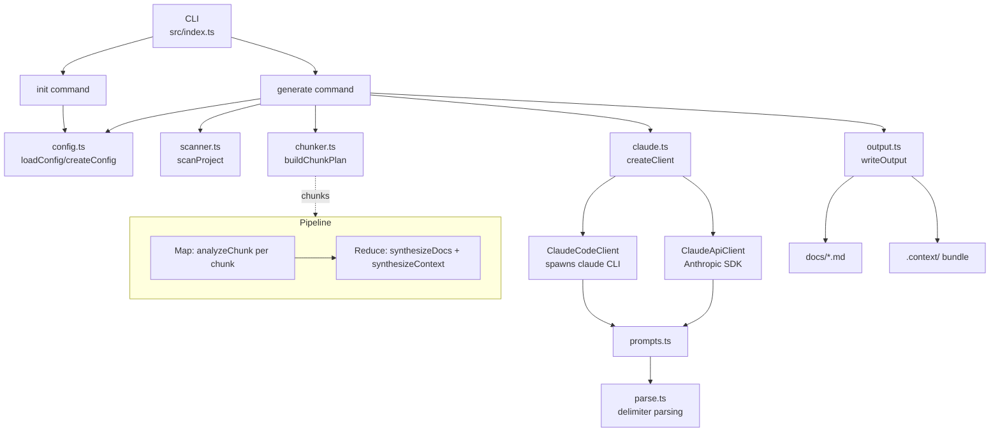

# Architecture

Lumiko is a CLI pipeline that scans a codebase, sends it to Claude for analysis, and writes structured documentation. It uses a map-reduce chunking strategy to handle large projects that exceed a single context window.

## System Overview

## Key Modules

| Module | Responsibility |
|---|---|
| `src/index.ts` | Commander CLI entry — wires `init` and `generate` subcommands |
| `src/commands/init.ts` | Bootstraps `.lumiko/config.yaml` and `docs/` |
| `src/commands/generate.ts` | Orchestrates the full pipeline (scan → chunk → generate → write) |
| `src/core/config.ts` | YAML config load/create with deep-merged defaults |
| `src/core/scanner.ts` | Glob-based file discovery + file tree formatting (skips binaries & files >100KB) |
| `src/core/chunker.ts` | Token estimation + chunk plan (group by dir → split by budget → merge small) |
| `src/core/claude.ts` | Factory: picks `ClaudeCodeClient` or `ClaudeApiClient` based on backend |
| `src/core/claude-code.ts` | Spawns `claude --print` CLI with prompt arg + stdin context |
| `src/core/claude-api.ts` | Uses `@anthropic-ai/sdk` with `ANTHROPIC_API_KEY` |
| `src/core/prompts.ts` | Builds all prompts (docs, context bundle, chunk analysis, synthesis) |
| `src/core/parse.ts` | Parses delimiter-wrapped Claude responses into structured output |
| `src/core/output.ts` | Writes markdown docs, context bundle, local-generated `manifest.json` |
| `src/types/index.ts` | Shared types: `LumikoConfig`, `ScannedFile`, `ChunkAnalysis`, `ContextBundle`, `DocGenerator` |

## Data Flow

1. **Load config** — `loadConfig` reads `.lumiko/config.yaml` and deep-merges with `DEFAULT_CONFIG`.
2. **Scan** — `scanProject` runs the include/exclude globs, filters binaries and large files, returns `ScannedFile[]`.
3. **Plan chunks** — `buildChunkPlan` estimates tokens (~4 chars/token + overhead), groups by top-level directory, splits oversized groups by budget, merges tiny ones.
4. **Decide strategy** — Chunking runs when `chunking.enabled === true` or (`"auto"` and `totalTokens > threshold`).
5. **Generate**
   - **Standard path**: one Claude call per artifact (`generateDocs`, `generateContext`).
   - **Chunked path (map-reduce)**:
     - **Map**: `analyzeChunk` for each chunk → `ChunkAnalysis` (summary, exports, architecture, API signatures).
     - **Reduce**: `synthesizeDocs` + `synthesizeContext` combine analyses into final outputs.
6. **Parse** — `parseGeneratedResponse` / `parseChunkAnalysis` / `parseContextBundle` extract content from delimiter markers (`---README_START---`, `---FILE:<path>---`, etc.). Failures save raw output to `.lumiko/last-*.txt` for debugging.
7. **Write** — `writeOutput` produces `docs/*.md` and the `.context/` bundle. `manifest.json` is built locally (not by Claude) so Lumiko owns its schema.

## Backends

Both implement the `DocGenerator` interface with 5 methods:
`generateDocs`, `generateContext`, `analyzeChunk`, `synthesizeDocs`, `synthesizeContext`.

- **`ClaudeCodeClient`** — `spawn('claude', ['--print', '--output-format', 'text', instruction])` with the codebase context piped via stdin. Validates the CLI exists via `ClaudeCodeClient.check()`. Notably does NOT pass `--model` (empty-response bug with large stdin). ANSI codes are stripped from output.
- **`ClaudeApiClient`** — Direct SDK calls with the full prompt as the user message. Returns token usage for cost reporting.

## External Dependencies

| Package | Purpose |
|---|---|
| `commander` | CLI argument parsing |
| `@anthropic-ai/sdk` | API backend |
| `glob` | File discovery |
| `js-yaml` | Config parsing |
| `ora` | Spinners |
| `chalk` | Terminal colors |
| `prompts` | Confirmation prompts |
| `tsup` | Build (ESM, node18, with shebang banner) |

## Design Decisions

- **Delimiter-based parsing over JSON** — Claude is more reliable producing markdown between `---TAG_START---` / `---TAG_END---` markers than returning valid JSON for long outputs. Parse failures save raw output for manual inspection.
- **Manifest generated locally** — `.context/manifest.json` is built by `buildManifest` in `output.ts`, not by Claude, so the schema and version are owned by Lumiko.
- **Map-reduce chunking by directory** — Files are grouped by top-level directory for coherence, then split/merged by token budget. This keeps related files together in the same chunk.
- **Partial-failure tolerance** — If some chunks fail analysis during the map phase, synthesis proceeds with the remaining ones rather than aborting.
- **Claude Code as default backend** — Uses the user's subscription; no API key required. The factory validates the CLI is installed before returning a client.
- **`cwd: os.tmpdir()` when spawning `claude`** — Prevents the CLI from picking up project-local Claude config.
